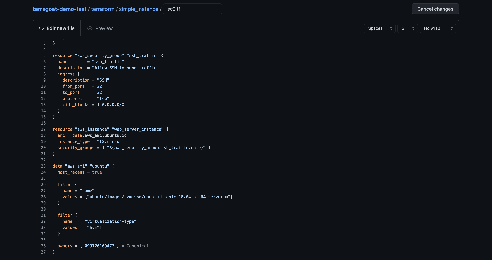
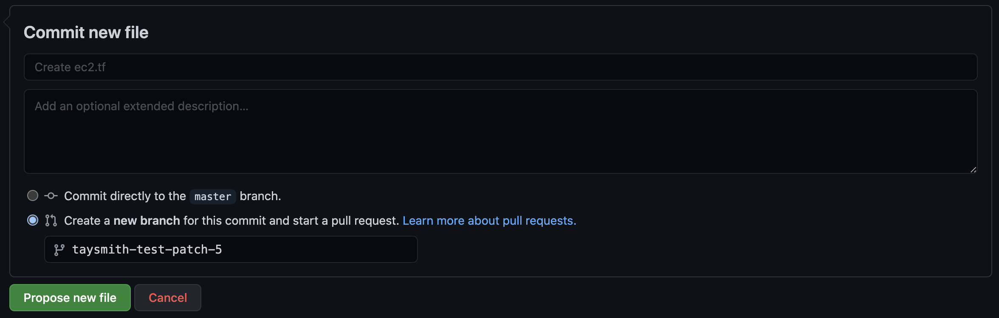
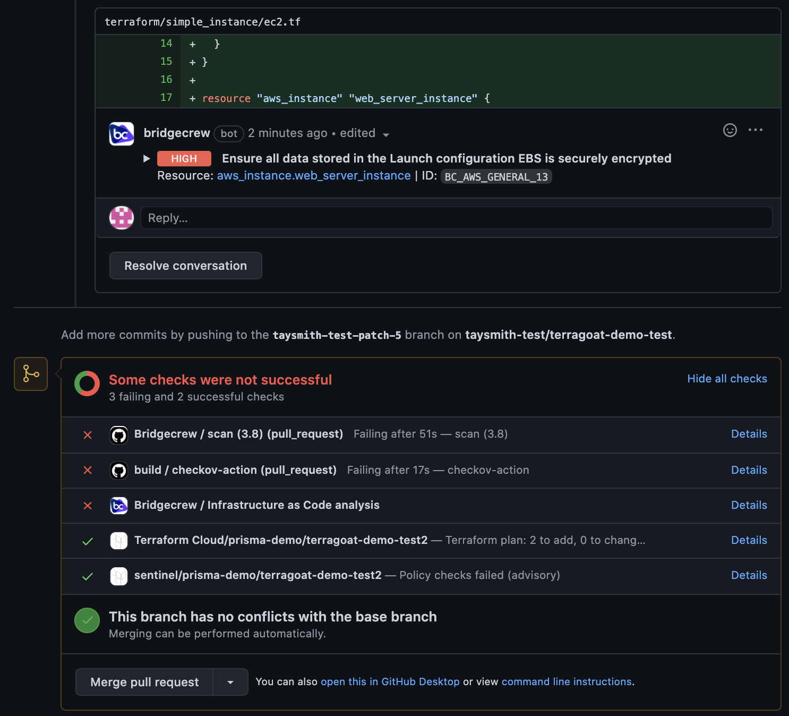
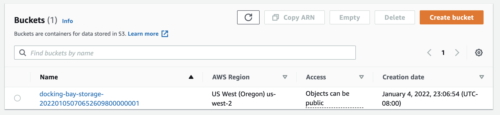

## Kick off a test pull request

Check that all three integrations are working by kicking off a pull request. Go back to your fork of the TerraGoat repo and select "Add file" -> "Create new file." Set the path to `terraform/simple_instance/s3.tf`. Add the following code:

```
provider "aws" {
  region = "us-west-2"
}

resource "aws_s3_bucket" "docking_bay" {
  bucket_prefix = "docking-bay-storage-"

  tags = {
    Name                 = "Docking Bay"
    Environment          = "Dev"
  }
}
```



Select "Create a new branch" and "Propose new file." 



Then "Create a pull request." After a few seconds, you should automatically see Code Review Comments. Expand one to see the additional details like Fix recommendations. At the bottom, you should see five checks:

- The Checkov GitHub Action
- The Bridgecrew GitHub Action
- The Bridgecrew GitHub Application
- The Terraform Cloud integration checks (if you added that integration) Note that this one will fail the first time because we haven't committed the directory yet



If you added the Yor GitHub Action, you will see that kick off and all of your resources will be tagged by Yor.

You can fix the violations later, but for now, click "Merge pull request" and "Confirm merge." 

#### With Terraform Cloud

If you added the Terraform Cloud integration - Head back over to Terraform Cloud and select the latest run. You'll again see the policy violations, but since we set the failure level to "advisory (logging only)," we can still apply the template.

Click "Confirm & Apply." This will deploy the simple S3 bucket. If you have the Yor GitHub Action, you may have to select that run as well and click "Confirm & Apply."

#### Without Terraform Cloud

Alternatively, locally you can run `git pull origin master` to update your local directory. Move to your `simple_instance` directory in your terminal (`cd terraform/simple_instance` from the `terragoat` directory). Then run `terraform init` to initialize your directory and `terraform apply` to create your S3 bucket and security group. Type `yes` and let Terraform provision your resources.


{}
We're using a free tier resource (S3), but remember to cleanup with terraform destroy at the end to avoid additional charges from AWS.
{}

#### Check that the bucket is live

Optionally, head over to your AWS console to confirm a bucket was created.




### Congratulations!

You’ve now set up a GitHub Action, a GitHub Application, and either a Terraform Cloud integration or Yor to secure your Terraform templates.

In the next module, you’ll look at how to investigate and fix the issues arising from the automated scans, as well as providing more tips for integrating security into the developer workflow without causing friction.