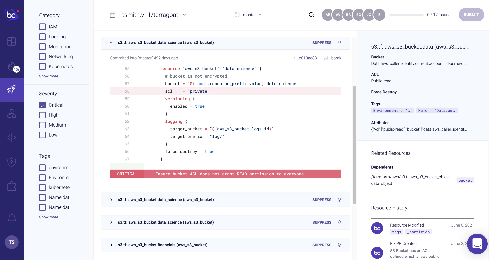
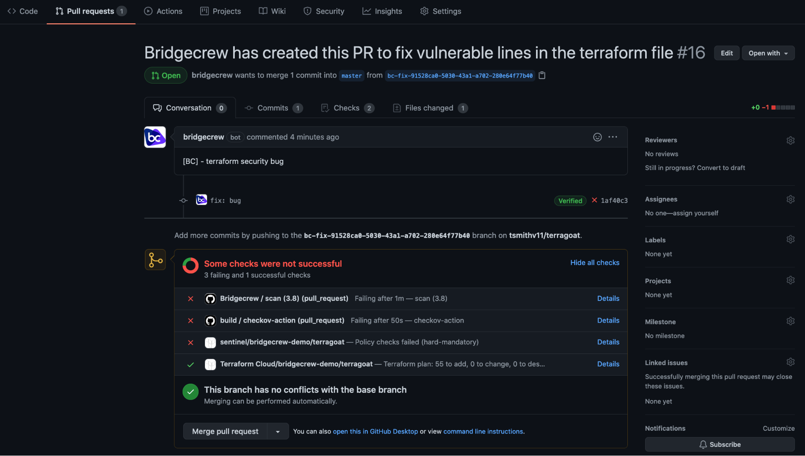

## Automating fixes through pull requests

Now that you’ve pulled in multiple infrastructure sources, you may get overwhelmed at the prospect of fixing the several dozen issues Bridgecrew has identified. To help us implement fixes as fast as possible, Bridgecrew generates and pushes fix pull requests back into your GitHub repository.

Let’s walk through the process with one of the policies you looked at earlier, "S3 Bucket has an ACL defined which allows public READ access."

The lightbulb icon takes you to the Bridgecrew docs for more information about the violation. We can also suppress that check for this specific resource. Finally, in the middle is the **Fix** button. This enables you to automatically create a pull request with the diff shown. In this case, it will remove the acl with `public-read` access and `force_destroy` setting.

You can include other fixes, but for the sake of this workshop, we’ll just do the one. Select **Submit**.

That created a pull request, but you’ll need to approve the patch to make the changes in your repository. Over in your TerraGoat repository in GitHub, you’ll see a new PR under the “Pull requests” tab, which is ready for review:

Because of the scans from previous steps, the Merge button won’t be highlighted. Merge the patch anyway. You’ll receive a confirmation that the PR was merged and closed.

Make sure to pull the origin locally to update your local copy of TerraGoat with the patch.

**Congratulations!**

You’ve built an automated IaC scanning workflow in a live environment and automated the fixing of an exposed S3 bucket!