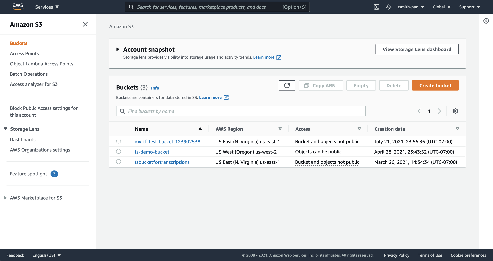

## Automating fixes in runtime

Similar to what we did with pull request fixes in the previous module, Bridgecrew allows for immediate remediation of issues in runtime by reconfiguring your objects via the AWS APIs. Typically, it's a best practice to make all changes to IaC provisioned resources in the code that provisioned them or else you create drift (discussed next). However, for resources not provisioned using IaC templates, runtime remediations make meeting compliance much easier.

Implementing automated remediations does require extra permissions than previously granted with the default AWS Read Only integration. When you attempt a runtime remediation without the correct permissions, you’ll be prompted to configure the AWS Remediation Stack: 


Adding the AWS Remediation stack follows the same workflow as the previous read-only AWS integration:


Select **Create Stack** and return to Bridgecrew, you will now be able to Remediate runtime resources:


## Adding an unencrypted S3 bucket

Let's add an S3 bucket that does not have default encryption turned (a critical misconfiguration). In the AWS console, find the S3 services page.



Select "Create bucket." Give it a globally unique name and leave everything else as the defaults. Notice that "Default encryption" is disabled.

Give Bridgecrew a minute to scan the new resource's configurations or jumpstart the scan with:

```bash
curl -X POST -H "Authorization: $YOUR_BC_API_KEY" https://www.bridgecrew.cloud/api/v1/scans/integrations
```

## Fixing the unencrypted S3 bucket

If we head over to the Incidents page and search for `BC_AWS_S3_14` you will find the policy titled "Ensure data stored in the S3 bucket is securely encrypted at rest."

The **Fix** button will now allow runtime changes to the S3 configuration:


Select **Fix** again to run the remediation. Bridgecrew will now use the AWS APIs to ensure encryption is turned on for the selected resource:


Checking the resource once more in the AWS Console, you will see that encryption is now enabled:


The violation will also have been marked resolved in the Bridgecrew **Incidents** page.

Instead of resolving issues in production, if you follow GitOps best practices, we should prevent changes in production. We'll cover how to handle drift in the next session.